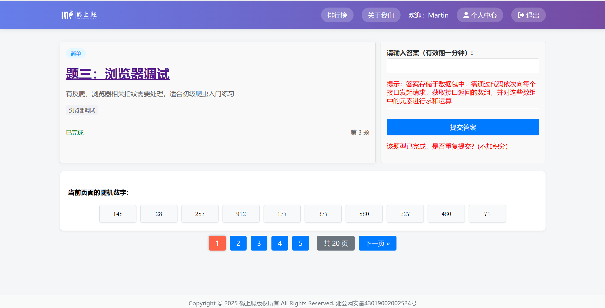
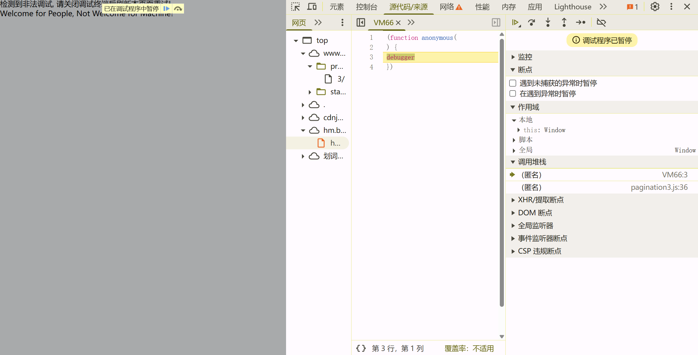

## 无限debugger反扒策略

通过不断触发 JavaScript 的 `debugger` 语句，**让浏览器开发者工具不停地暂停执行**，从而**阻止你调试、阅读或修改代码**。

本文章以[码上爬第三题为例](https://www.mashangpa.com/problem-detail/3/) 



鼠标右键显示：


是的、BUFF叠满。

chorm 快捷键打开 `ctrl shift i` 打开后台



页面被替换、代码被 `debugger` 断住无法正常查看请求。


只有两个调用栈、最下面的就是debugger的地方
## 调试方案

快速方案： 
1. 全局禁用debugger （此处没用、页面已经被修改）
2. 断点处 Never pause here：从不在此处暂停  （此处也没用）

### 替换文件

鼠标右键 - 点击替换文件 - 选择一个文件夹 将一下内容注释掉（debugger内容代码）刷新页面即可


### hook钩子技术

把“钩子”挂在关键函数上，原代码一执行，就先被你拦下来。

```js
原函数  →  Hook函数  →  原函数
```

